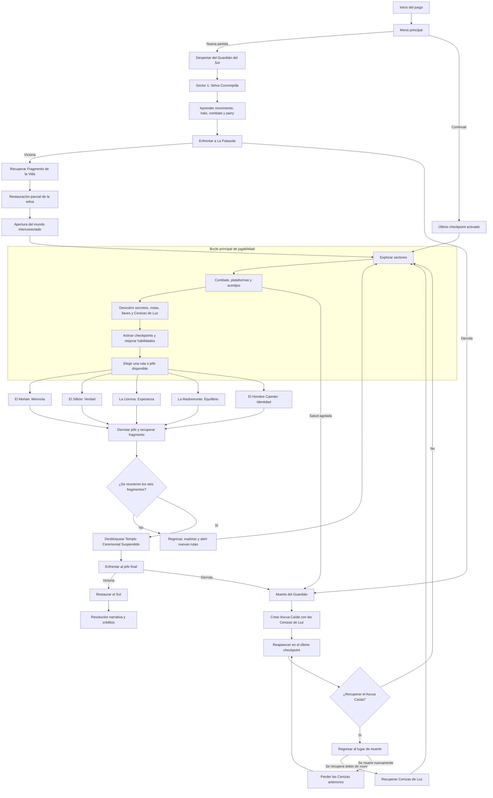
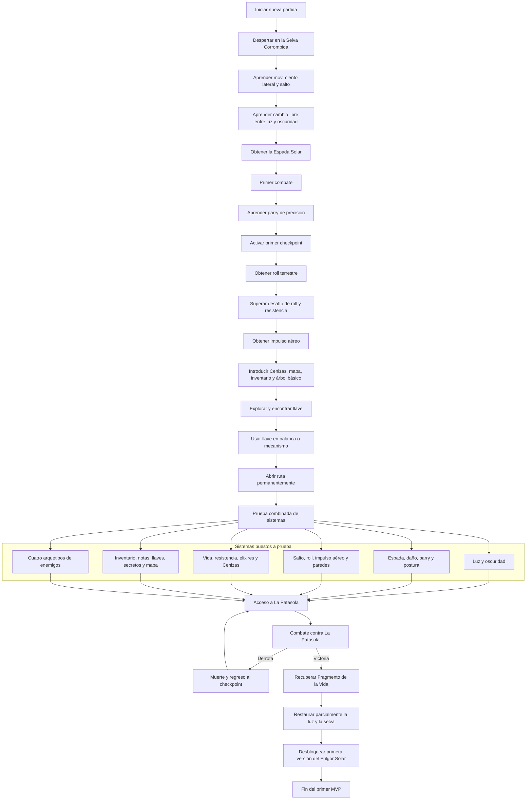
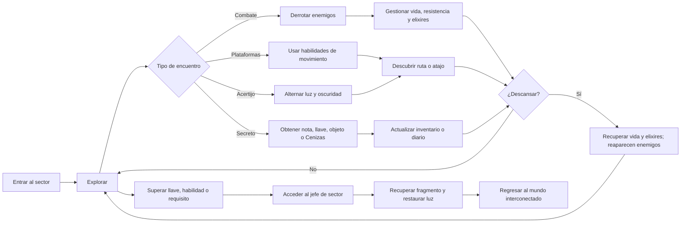

# DIAGRAMA DE FLUJO DE JUGABILIDAD
## ASHES OF THE FIRST LIGHT

Este documento representa visualmente el flujo general del juego y la secuencia jugable del primer MVP. Debe actualizarse cuando cambien las decisiones principales del `GDD.md`.

---

## 1. Flujo general del juego

---

## 2. Flujo del primer MVP

---

## 3. Bucle de exploración de un sector

---

## Estado del documento

Los flujos representan las decisiones actuales del GDD. El diseño exacto de salas, encuentros, tiempos, posición de checkpoints, comportamiento detallado de La Patasola y presentación final permanecen **pendientes de definición para sesiones posteriores**.
