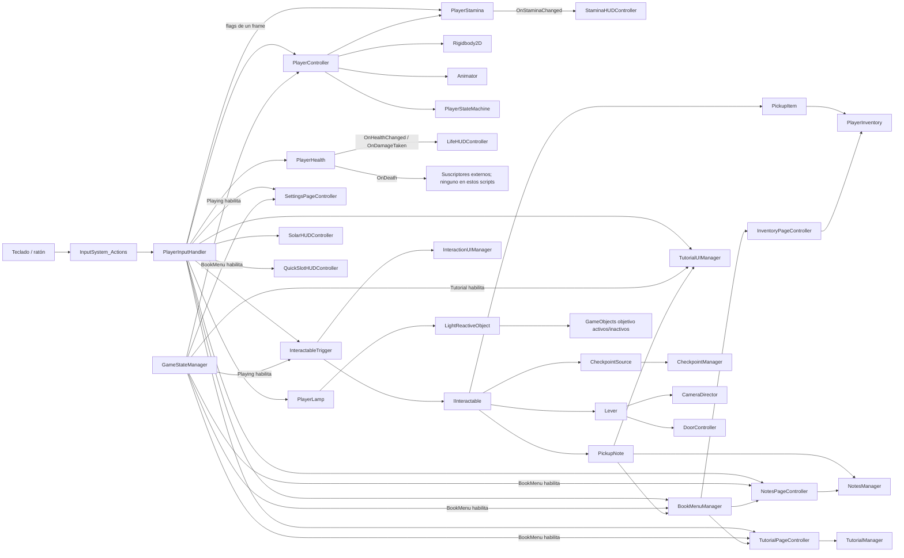
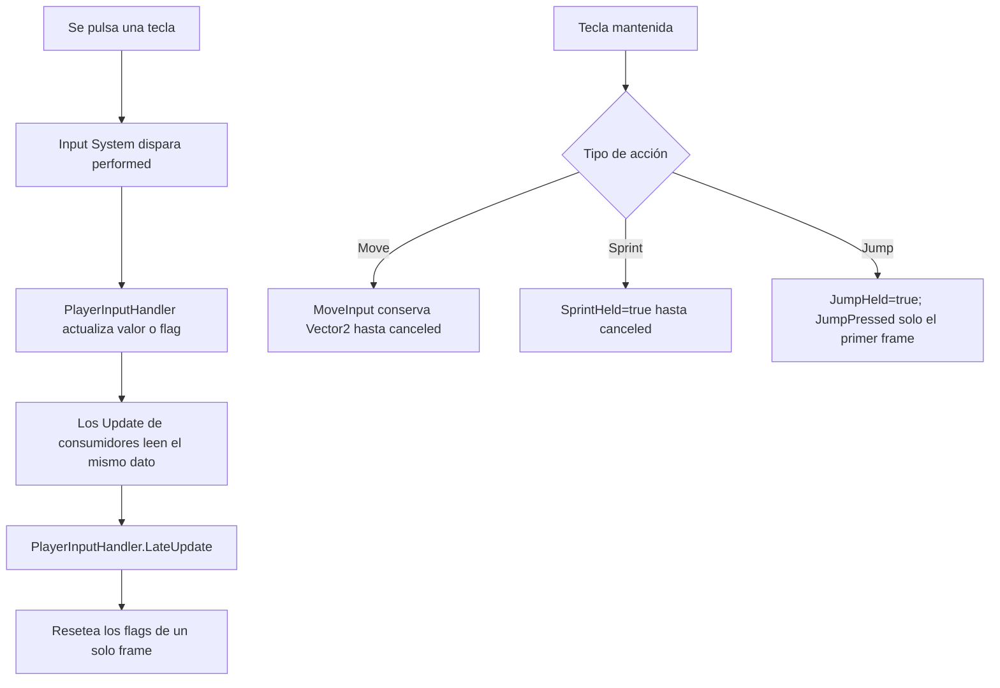
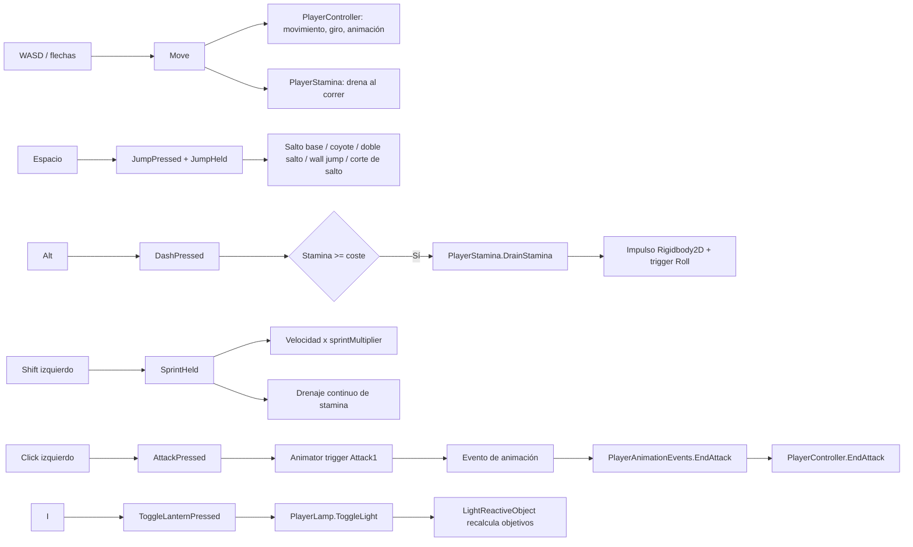
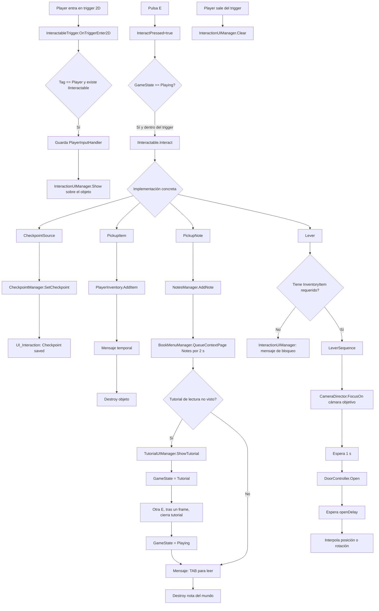
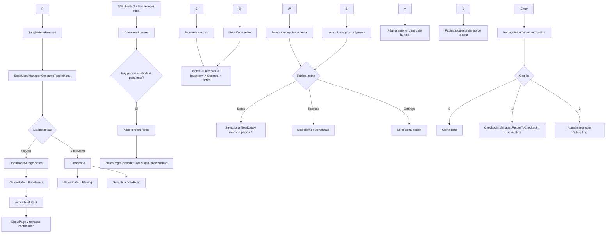
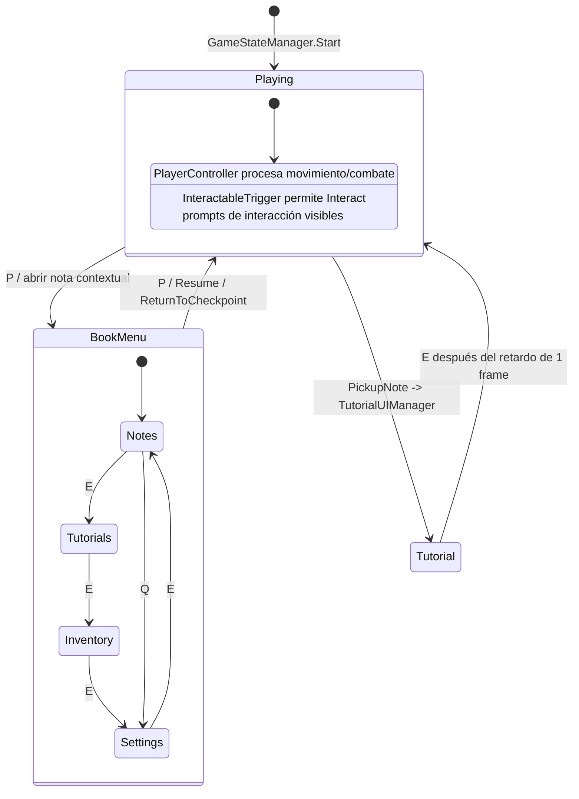
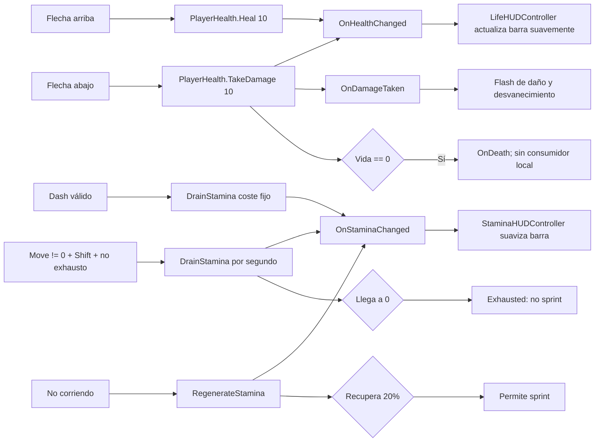
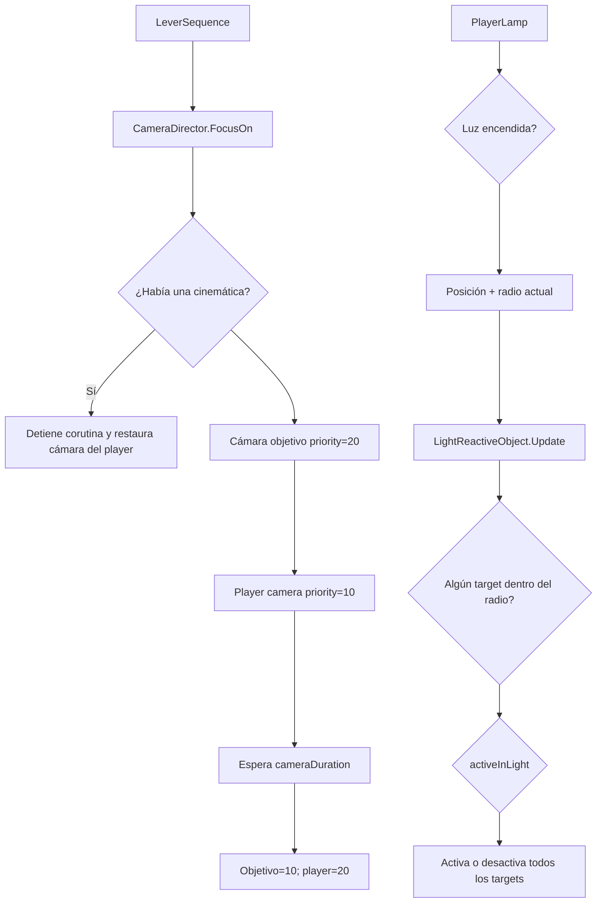
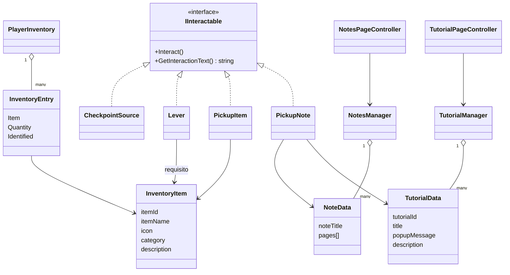

# Flujo completo de scripts

Fuente principal: `Assets/MyAssets/Scripts/todos_los_scripts.txt`. Para identificar las teclas físicas también se contrastó `Assets/InputSystem_Actions.inputactions`.

## 1. Arquitectura general

## 2. Entrada: de una tecla al consumidor

`PlayerInputHandler` crea y habilita el mapa `Player`. Las acciones continuas (`Move`, `Sprint`, `JumpHeld`) conservan estado; las demás levantan un booleano que se limpia en `LateUpdate`, después de que los demás `Update` hayan podido leerlo.

## 3. Flujo completo de interacción con E

Nota: la misma `E` también activa `NextBookPage`; si el libro está abierto, `BookMenuManager` cambia de sección. Además `PlayerLamp.Update` usa `InteractPressed` para aumentar temporalmente el radio de luz en 1, sin comprobar el estado de juego. Por eso una interacción también aumenta la lámpara mientras no haya llegado al máximo.

## 4. Libro, notas, tutoriales e inventario

`InventoryPageController` actualmente solo crea y selecciona las categorías visuales; no obtiene ni dibuja todavía los `InventoryEntry` de `PlayerInventory`.

## 5. Estados globales y bloqueo de sistemas

`PlayerController.FixedUpdate` pone la velocidad a cero cuando no está en `Playing`. Sin embargo, `PlayerLamp`, `PlayerHealth`, `PlayerStamina`, `SolarHUDController` y `QuickSlotHUDController` no consultan `GameStateManager`, por lo que siguen procesando sus entradas o actualizaciones también durante libro/tutorial.

## 6. Vida, stamina y HUD

Controles de depuración adicionales: `'` restaura 0.5 de energía solar, `;` consume 0.5, `.` desbloquea un quick slot y `,` bloquea uno.

## 7. Cámara, puerta y objetos reactivos a luz

## 8. Relaciones de datos

## 9. Hallazgos importantes del flujo actual

- `CameraTrigger.TryActivate()` nunca es llamado: el bloque automático está comentado y, cuando requiere entrada, `Update()` llama al `IInteractable` padre, no a `TryActivate()`. Por sí solo, este script no inicia su enfoque de cámara.
- Hay dos controladores para abrir/cerrar menú (`BookMenuManager` y `GameMenuController`) leyendo el mismo `ToggleMenuPressed`. `BookMenuManager` lo consume, pero el resultado depende del orden de `Update`; si `GameMenuController` corre primero puede cambiar el estado antes que el libro y dejar la UI desincronizada.
- `E` tiene tres consumidores: interacción, página siguiente del libro y aumento temporal del radio de lámpara. El estado limita algunos consumidores, pero no `PlayerLamp`.
- `W/S/A/D` sirven simultáneamente para movimiento y navegación del libro. El movimiento físico queda frenado fuera de `Playing`, pero el vector de entrada sigue activo.
- `TutorialCodexManager` y `TutorialManager` mantienen listas de tutoriales separadas. En este conjunto de scripts, las pantallas usan `TutorialManager`; `TutorialCodexManager` no tiene consumidores.
- `NotesUIManager` ofrece un segundo flujo para mostrar notas, pero no hay ninguna llamada a `OpenNote()` dentro de estos scripts. El flujo activo de notas parece ser `BookMenuManager` + `NotesPageController`.
- La muerte solo emite `PlayerHealth.OnDeath`; ningún script del archivo está suscrito, así que no hay respawn, pantalla de muerte ni cambio de estado implementado aquí.
- `CameraDirector.SetCamera()` tampoco tiene llamadas dentro de este conjunto.
- Las referencias `[SerializeField]`, jerarquías padre/hijo de GameObjects y eventos conectados desde el Inspector no pueden inferirse completamente desde el `.txt`; el diagrama refleja dependencias de código y búsquedas de componentes. Para mapear la jerarquía exacta habría que analizar escenas y prefabs.
